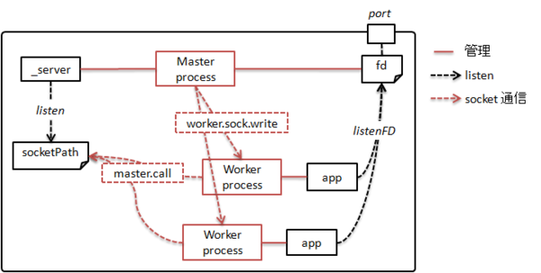

# Supervisor Settings

[Supervisor によるプロセス管理](https://debug-life.net/entry/989)

## 最低限の設定項目

- inet_http_server - TCP ソケットで listen する HTTP サーバーの設定。
- supervisord - supervisord プロセスに関する設定。
- rpcinterface:supervisor
- supervisorctl
- program:x - supervisord 管理下で動作させるプログラムの設定。

# Redis Sentinel

Redis サーバの死活監視/通知および自動フェイルオーバー機能を提供する管理サーバ(redis-sentinel)

- [Redis Sentinel で自動フェイルオーバー](https://qiita.com/wellflat/items/8935016fdee25d4866d9)
- [インメモリ KVS の Redis について](https://rest-term.com/archives/2898/)

## Redis tools App

- Redis コマンド
- Redis Sentinel
- Redis Live
- Redis Faina
- Redis Sampler
- redis-top
- Nagios プラグイン
- Zabbix テンプレート
- Munin プラグイン
- Cacti プラグイン

# Cluster

## Cluster の仕組み

